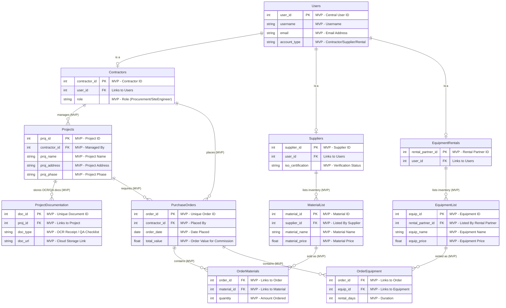

```mermaid
erDiagram
    %% ==========================================
    %% Centralized User Management
    %% ==========================================
    Users {
        int user_id PK "MVP - Central User ID"
        string username "MVP - Username"
        string email "MVP - Email Address"
        string account_type "MVP - Contractor/Supplier/Rental"
    }

    %% ==========================================
    %% Role-Specific Entities
    %% ==========================================
    Contractors {
        int contractor_id PK "MVP - Contractor ID"
        int user_id FK "Links to Users"
        string role "MVP - Role (Procurement/SiteEngineer)"
    }

    Suppliers {
        int supplier_id PK "MVP - Supplier ID"
        int user_id FK "Links to Users"
        string iso_certification "MVP - Verification Status"
    }

    EquipmentRentals {
        int rental_partner_id PK "MVP - Rental Partner ID"
        int user_id FK "Links to Users"
    }

    %% ==========================================
    %% Catalogs & Inventory
    %% ==========================================
    MaterialList {
        int material_id PK "MVP - Material ID"
        int supplier_id FK "MVP - Listed By Supplier"
        string material_name "MVP - Material Name"
        float material_price "MVP - Material Price"
    }

    EquipmentList {
        int equip_id PK "MVP - Equipment ID"
        int rental_partner_id FK "MVP - Listed By Rental Partner"
        string equip_name "MVP - Equipment Name"
        float equip_price "MVP - Equipment Price"
    }

    %% ==========================================
    %% Transactions & Orders
    %% ==========================================
    PurchaseOrders {
        int order_id PK "MVP - Unique Order ID"
        int contractor_id FK "MVP - Placed By"
        date order_date "MVP - Date Placed"
        float total_value "MVP - Order Value for Commission"
    }

    %% Bridge Tables for Order Line Items
    OrderMaterials {
        int order_id FK "MVP - Links to Order"
        int material_id FK "MVP - Links to Material"
        int quantity "MVP - Amount Ordered"
    }

    OrderEquipment {
        int order_id FK "MVP - Links to Order"
        int equip_id FK "MVP - Links to Equipment"
        int rental_days "MVP - Duration"
    }

    %% ==========================================
    %% Project Management
    %% ==========================================
    Projects {
        int proj_id PK "MVP - Project ID"
        int contractor_id FK "MVP - Managed By"
        string proj_name "MVP - Project Name"
        string proj_address "MVP - Project Address"
        string proj_phase "MVP - Project Phase"
    }

    ProjectDocumentation {
        int doc_id PK "MVP - Unique Document ID"
        int proj_id FK "MVP - Links to Project"
        string doc_type "MVP - OCR Receipt / QA Checklist"
        string doc_url "MVP - Cloud Storage Link"
    }
    
    %% ==========================================
    %% Entity Relationships
    %% ==========================================
    Users ||--o| Contractors : "is a"
    Users ||--o| Suppliers : "is a"
    Users ||--o| EquipmentRentals : "is a"

    Contractors ||--o{ Projects : "manages (MVP)"
    Contractors ||--o{ PurchaseOrders : "places (MVP)"
    
    Projects ||--o{ ProjectDocumentation : "stores OCR/QA docs (MVP)"
    Projects ||--o{ PurchaseOrders : "requires (MVP)"

    Suppliers ||--o{ MaterialList : "lists inventory (MVP)"
    EquipmentRentals ||--o{ EquipmentList : "lists inventory (MVP)"

    PurchaseOrders ||--o{ OrderMaterials : "contains (MVP)"
    PurchaseOrders ||--o{ OrderEquipment : "contains (MVP)"
    
    MaterialList ||--o{ OrderMaterials : "sold as (MVP)"
    EquipmentList ||--o{ OrderEquipment : "rented as (MVP)"
```
