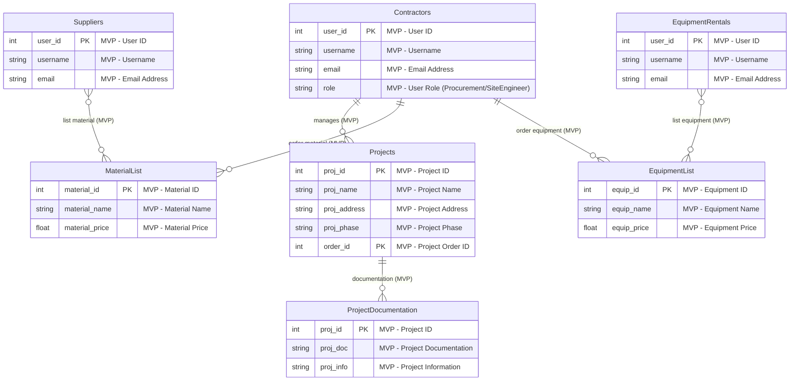

# Project Flow - 3NF Data Diagram (Entity Relation Diagram)

```mermaid
erDiagram
    %% ==========================================
    %% Entity & 3NF Schema Definitions
    %% ==========================================
    Contractors {
        int user_id PK "MVP - User ID"
        string username "MVP - Username"
        string email "MVP - Email Address"
        string role "MVP - User Role (Procurement/SiteEngineer)"
    }

    Suppliers {
        int user_id PK "MVP - User ID"
        string username "MVP - Username"
        string email "MVP - Email Address" 
    }

    EquipmentRentals {
        int user_id PK "MVP - User ID"
        string username "MVP - Username"
        string email "MVP - Email Address"
    }

    MaterialList {
        int material_id PK "MVP - Material ID"
        string material_name "MVP - Material Name"
        float material_price "MVP - Material Price"
    }

    EquipmentList {
        int equip_id PK "MVP - Equipment ID"
        string equip_name "MVP - Equipment Name"
        float equip_price "MVP - Equipment Price"
    }

    Projects {
        int proj_id PK "MVP - Project ID"
        string proj_name "MVP - Project Name"
        string proj_address "MVP - Project Address"
        string proj_phase "MVP - Project Phase"
        int order_id PK "MVP - Project Order ID"
    }

    ProjectDocumentation {
        int proj_id PK "MVP - Project ID"
        string proj_doc "MVP - Project Documentation"
        string proj_info "MVP - Project Information"
    }
    
    %% ==========================================
    %% Entity Relationships
    %% ==========================================
    Contractors ||--o{ Projects : "manages (MVP)"
    Contractors ||--o{ MaterialList : "order material (MVP)"
    Contractors ||--o{ EquipmentList : "order equipment (MVP)"

    Projects ||--o{ ProjectDocumentation : "documentation (MVP)"
    
    Suppliers }o--o{ MaterialList : "list material (MVP)"
    EquipmentRentals }o--o{ EquipmentList : "list equipment (MVP)"
    
```
