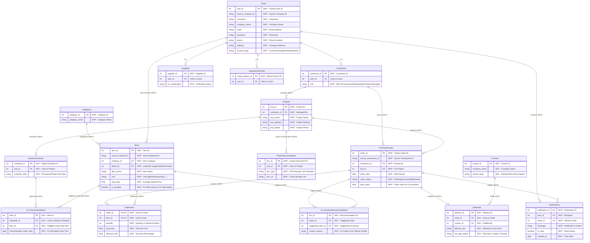

```mermaid
erDiagram
    %% ==========================================
    %% Centralized User Management
    %% ==========================================
    Users {
        int user_id PK "MVP - Central User ID"
        string source_company_id "MVP - Source Company ID"
        string username "MVP - Username"
        string company_name "MVP - Company Name"
        string email "MVP - Email Address"
        string password "MVP - Password"
        string phone "MVP - Phone Number"
        string address "MVP - Company Address"
        string account_type "MVP - Contractor/Supplier/Rental/Admin"
    }

    %% ==========================================
    %% Role-Specific Entities & Third-Parties
    %% ==========================================
    Contractors {
        int contractor_id PK "MVP - Contractor ID"
        int user_id FK "Links to Users"
        string role "MVP - Role (Procurement/SiteEngineer/Project Manager)"
    }

    Suppliers {
        int supplier_id PK "MVP - Supplier ID"
        int user_id FK "Links to Users"
        string iso_certification "MVP - Verification Status"
    }

    EquipmentRentals {
        int rental_partner_id PK "MVP - Rental Partner ID"
        int user_id FK "Links to Users"
    }

    Couriers {
        int courier_id PK "ADV - Courier ID"
        string company_name "ADV - Company Name"
        string service_type "ADV - Standard/Hot-Shot Express"
    }

    %% ==========================================
    %% Catalogs & Inventory
    %% ==========================================
    Categories {
        int category_id PK "MVP - Category ID"
        string category_name "MVP - Category Name"
    }

    Items {
        int item_id PK "MVP - Item ID"
        string source_material_id "MVP - Source Material ID"
        int category_id FK "MVP - Item Category"
        int listed_by FK "MVP - Listed By Supplier/Rental Partner"
        string item_name "MVP - Item Name"
        string unit "MVP - Unit (kg/Piece/Hour/Day/...)"
        float avg_price "MVP - Average Market Price"
        boolean is_rentable "MVP - For Rent (true) or For Sale (false)"
    }

    %% ==========================================
    %% Project Management & AI Scheduling
    %% ==========================================
    Projects {
        int proj_id PK "MVP - Project ID"
        int contractor_id FK "MVP - Managed By"
        string proj_name "MVP - Project Name"
        string proj_address "MVP - Project Address"
        string proj_phase "MVP - Project Phase"
    }

    ProjectDocumentation {
        int doc_id PK "MVP - Unique Document ID"
        int proj_id FK "MVP - Links to Project"
        string doc_type "MVP - OCR Receipt / QA Checklist"
        string doc_url "MVP - Cloud Storage Link"
    }

    MasterSchedules {
        int schedule_id PK "ADV - Digital Schedule ID"
        int proj_id FK "ADV - Links to Project"
        string schedule_data "ADV - Primavera/Project File Data"
    }

    AI_ProcurementAlerts {
        int alert_id PK "ADV - Alert ID"
        int schedule_id FK "ADV - Links to Master Schedule"
        int item_id FK "ADV - Flagged Long-Lead Item"
        date recommended_order_date "ADV - AI Calculated Lead Time"
    }

    %% ==========================================
    %% Transactions, Logistics, and AI Reminders
    %% ==========================================
    PurchaseOrders {
        int order_id PK "MVP - Unique Order ID"
        string source_transaction_id "MVP - Source Transaction ID"
        int contractor_id FK "MVP - Placed By"
        int proj_id FK "MVP - For Project"
        date order_date "MVP - Date Placed"
        string order_status "MVP - Pending/Processed/Delivered"
        float total_value "MVP - Order Value for Commission"
    }

    OrderItems {
        int order_id PK, FK "MVP - Links to Order"
        int item_id PK, FK "MVP - Links to Item"
        int quantity "MVP - Quantity or Rental Duration"
        float unit_price "MVP - Price Per Unit"
        float discount_rate "MVP - Discount Percentage"
    }

    AI_AuxiliaryRecommendations {
        int rec_id PK "ADV - Recommendation ID"
        int order_id FK "ADV - Triggering Order"
        int suggested_item_id FK "ADV - Suggested Accessory"
        string context_reason "ADV - AI Context (e.g. Marine Grade)"
    }

    Deliveries {
        int delivery_id PK "ADV - Delivery ID"
        int order_id FK "ADV - Links to Order"
        int courier_id FK "ADV - Fulfilled By"
        string delivery_tier "ADV - Standard vs Hot-Shot"
        string live_gps_status "ADV - Real-time Location Tracking"
    }
    
    %% ==========================================
    %% Notifications
    %% ==========================================
    Notifications {
        int notification_id PK "MVP - Notification ID"
        int user_id FK "MVP - Recipient"
        int order_id FK "MVP - Related Order"
        string message "MVP - Notification Content"
        boolean is_read "MVP - Read Status"
        date created_at "MVP - Time Sent"
    }

    %% ==========================================
    %% Entity Relationships
    %% ==========================================
    Users ||--o| Contractors : "is a"
    Users ||--o| Suppliers : "is a"
    Users ||--o| EquipmentRentals : "is a"

    Contractors ||--o{ Projects : "manages (MVP)"
    Contractors ||--o{ PurchaseOrders : "places (MVP)"
    
    Projects ||--o{ ProjectDocumentation : "stores OCR/QA docs (MVP)"
    Projects ||--o| MasterSchedules : "tracked by (ADV)"
    Projects ||--o{ PurchaseOrders : "requires (MVP)"

    MasterSchedules ||--o{ AI_ProcurementAlerts : "generates (ADV)"
    Items ||--o{ AI_ProcurementAlerts : "flagged as long-lead (ADV)"

    Categories ||--o{ Items : "categorizes (MVP)"
    Users ||--o{ Items : "lists inventory (MVP)"

    PurchaseOrders ||--o{ OrderItems : "contains (MVP)"
    
    PurchaseOrders ||--o{ AI_AuxiliaryRecommendations : "triggers (ADV)"
    Items ||--o{ AI_AuxiliaryRecommendations : "suggests (ADV)"

    Items ||--o{ OrderItems : "ordered as (MVP)"

    PurchaseOrders ||--o| Deliveries : "shipped via (ADV)"
    Couriers ||--o{ Deliveries : "fulfills (ADV)"

    Users ||--o{ Notifications : "receives (MVP)"
    PurchaseOrders ||--o{ Notifications : "triggers (MVP)"
```
