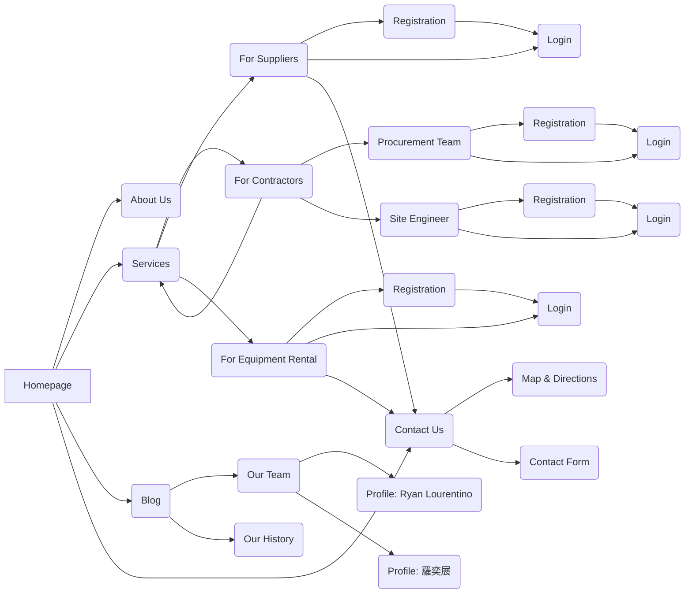

# Project Flow
Software Engineering in Construction Management - Assignment #2

## Student Information
| Name | Student ID |
|------|-------------|
| Ryan Lourentino A. | M11505803 |
| 羅奕展 | M11505505 |

