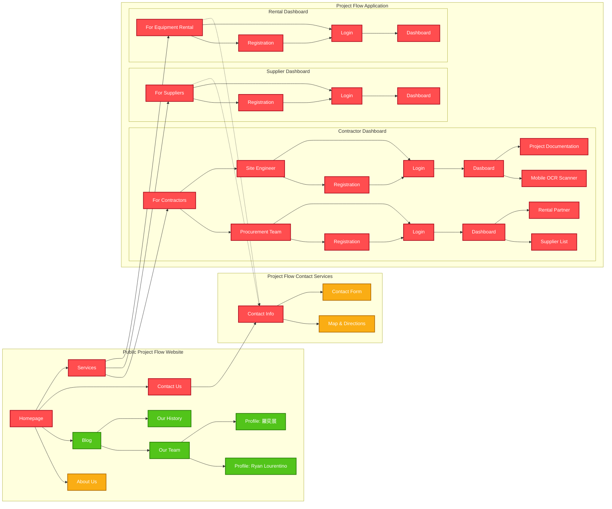

# Project Flow
Software Engineering in Construction Management - Assignment #2

## Student Information
| Name | Student ID |
|------|-------------|
| Ryan Lourentino A. | M11505803 |
| 羅奕展 | M11505505 |

## Priority Legend

| Priority | Color | Description |
|---|---|---|
|  High | Red | Core functions that should be implemented first |
|  Medium | Yellow | Important functions implemented after the core functions |
|  Low | Green | Optional or lower-priority functions |

