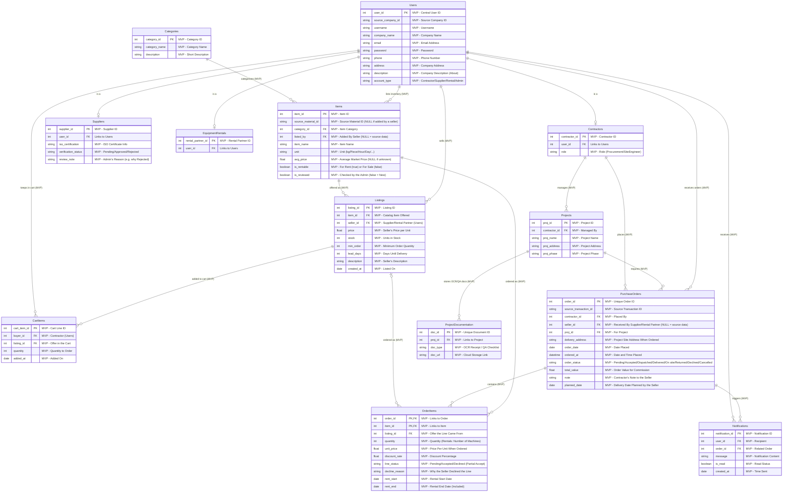

```mermaid
erDiagram
    %% ==========================================
    %% Centralized User Management
    %% ==========================================
    Users {
        int user_id PK "MVP - Central User ID"
        string source_company_id "MVP - Source Company ID"
        string username "MVP - Username"
        string company_name "MVP - Company Name"
        string email "MVP - Email Address"
        string password "MVP - Password"
        string phone "MVP - Phone Number"
        string address "MVP - Company Address"
        string description "MVP - Company Description (About)"
        string account_type "MVP - Contractor/Supplier/Rental/Admin"
    }

    %% ==========================================
    %% Role-Specific Entities
    %% ==========================================
    Contractors {
        int contractor_id PK "MVP - Contractor ID"
        int user_id FK "Links to Users"
        string role "MVP - Role (Procurement/SiteEngineer)"
    }

    Suppliers {
        int supplier_id PK "MVP - Supplier ID"
        int user_id FK "Links to Users"
        string iso_certification "MVP - ISO Certificate Info"
        string verification_status "MVP - Pending/Approved/Rejected"
        string review_note "MVP - Admin's Reason (e.g. why Rejected)"
    }

    EquipmentRentals {
        int rental_partner_id PK "MVP - Rental Partner ID"
        int user_id FK "Links to Users"
    }

    %% ==========================================
    %% Catalogs & Inventory
    %% ==========================================
    Categories {
        int category_id PK "MVP - Category ID"
        string category_name "MVP - Category Name"
        string description "MVP - Short Description"
    }

    Items {
        int item_id PK "MVP - Item ID"
        string source_material_id "MVP - Source Material ID (NULL if added by a seller)"
        int category_id FK "MVP - Item Category"
        int listed_by FK "MVP - Added By Seller (NULL = source data)"
        string item_name "MVP - Item Name"
        string unit "MVP - Unit (kg/Piece/Hour/Day/...)"
        float avg_price "MVP - Average Market Price (NULL if unknown)"
        boolean is_rentable "MVP - For Rent (true) or For Sale (false)"
        boolean is_reviewed "MVP - Checked by the Admin (false = New)"
    }

    %% ==========================================
    %% Marketplace (web app, Assignment #4)
    %% ==========================================
    Listings {
        int listing_id PK "MVP - Listing ID"
        int item_id FK "MVP - Catalog Item Offered"
        int seller_id FK "MVP - Supplier/Rental Partner (Users)"
        float price "MVP - Seller's Price per Unit"
        int stock "MVP - Units in Stock"
        int min_order "MVP - Minimum Order Quantity"
        int lead_days "MVP - Days Until Delivery"
        string description "MVP - Seller's Description"
        date created_at "MVP - Listed On"
    }

    CartItems {
        int cart_item_id PK "MVP - Cart Line ID"
        int buyer_id FK "MVP - Contractor (Users)"
        int listing_id FK "MVP - Offer in the Cart"
        int quantity "MVP - Quantity to Order"
        date added_at "MVP - Added On"
    }

    %% ==========================================
    %% Transactions & Orders
    %% ==========================================
    PurchaseOrders {
        int order_id PK "MVP - Unique Order ID"
        string source_transaction_id "MVP - Source Transaction ID"
        int contractor_id FK "MVP - Placed By"
        int seller_id FK "MVP - Received By Supplier/Rental Partner (NULL = source data)"
        int proj_id FK "MVP - For Project"
        string delivery_address "MVP - Project Site Address When Ordered"
        date order_date "MVP - Date Placed"
        datetime ordered_at "MVP - Date and Time Placed"
        string order_status "MVP - Pending/Accepted/Dispatched/Delivered/On site/Returned/Declined/Cancelled"
        float total_value "MVP - Order Value for Commission"
        string note "MVP - Contractor's Note to the Seller"
        date planned_date "MVP - Delivery Date Planned by the Seller"
    }

    %% Bridge Table for Order Line Items
    OrderItems {
        int order_id PK, FK "MVP - Links to Order"
        int item_id PK, FK "MVP - Links to Item"
        int listing_id FK "MVP - Offer the Line Came From"
        int quantity "MVP - Quantity (Rentals: Number of Machines)"
        float unit_price "MVP - Price Per Unit When Ordered"
        float discount_rate "MVP - Discount Percentage"
        string line_status "MVP - Pending/Accepted/Declined (Partial Accept)"
        string decline_reason "MVP - Why the Seller Declined the Line"
        date rent_start "MVP - Rental Start Date"
        date rent_end "MVP - Rental End Date (Included)"
    }

    %% ==========================================
    %% Project Management
    %% ==========================================
    Projects {
        int proj_id PK "MVP - Project ID"
        int contractor_id FK "MVP - Managed By"
        string proj_name "MVP - Project Name"
        string proj_address "MVP - Project Address"
        string proj_phase "MVP - Project Phase"
    }

    ProjectDocumentation {
        int doc_id PK "MVP - Unique Document ID"
        int proj_id FK "MVP - Links to Project"
        string doc_type "MVP - OCR Receipt / QA Checklist"
        string doc_url "MVP - Cloud Storage Link"
    }


    %% ==========================================
    %% Notifications
    %% ==========================================
    Notifications {
        int notification_id PK "MVP - Notification ID"
        int user_id FK "MVP - Recipient"
        int order_id FK "MVP - Related Order"
        string message "MVP - Notification Content"
        boolean is_read "MVP - Read Status"
        date created_at "MVP - Time Sent"
    }

    %% ==========================================
    %% Entity Relationships
    %% ==========================================
    Users ||--o| Contractors : "is a"
    Users ||--o| Suppliers : "is a"
    Users ||--o| EquipmentRentals : "is a"

    Contractors ||--o{ Projects : "manages (MVP)"
    Contractors ||--o{ PurchaseOrders : "places (MVP)"
    
    Projects ||--o{ ProjectDocumentation : "stores OCR/QA docs (MVP)"
    Projects ||--o{ PurchaseOrders : "requires (MVP)"

    Categories ||--o{ Items : "categorizes (MVP)"
    Users ||--o{ Items : "lists inventory (MVP)"
    Items ||--o{ Listings : "offered as (MVP)"
    Users ||--o{ Listings : "sells (MVP)"
    Users ||--o{ CartItems : "keeps in cart (MVP)"
    Listings ||--o{ CartItems : "added to cart (MVP)"
    Users ||--o{ PurchaseOrders : "receives orders (MVP)"
    Listings |o--o{ OrderItems : "ordered as (MVP)"

    PurchaseOrders ||--o{ OrderItems : "contains (MVP)"
    
    Items ||--o{ OrderItems : "ordered as (MVP)"

    Users ||--o{ Notifications : "receives (MVP)"
    PurchaseOrders ||--o{ Notifications : "triggers (MVP)"
```
